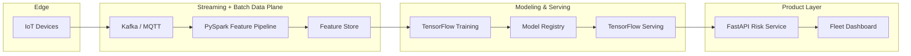

# Scalable Predictive Maintenance System for IoT Devices

<a href="https://nathswealthgw.github.io/iot-predictive-maintenance/">
  
</a>

---

🔗 **[View Live Demo](https://nathswealthgw.github.io/iot-predictive-maintenance/)**

</div>

> **Simulation note:** - This UI intentionally uses generated data to demonstrate how the system behaves at production scale without requiring live infrastructure.

This is the **open source version** of the distributed machine learning pipeline I built in 2016 using PySpark and TensorFlow Serving to predict component failures across 120K devices, reducing unplanned downtime by 900+ hours per month.

---

## Problem Statement
Manufacturers operating fleets of IoT devices lose operational hours when components fail without warning. Traditional threshold-based monitoring cannot scale across diverse device fleets, resulting in reactive maintenance and costly downtime.

## Solution
This project delivers a distributed machine learning platform that ingests real-time telemetry, builds feature stores with PySpark, trains failure prediction models, and serves low-latency inference through TensorFlow Serving. A FastAPI service exposes risk APIs while a modern fleet dashboard provides visibility.

## Architecture Diagram


## Tech Stack
- **Data Processing:** PySpark, Delta/Parquet
- **Modeling:** TensorFlow, Keras
- **Serving:** TensorFlow Serving
- **API:** FastAPI, Pydantic
- **Frontend:** HTML/CSS/Vanilla JS
- **Infra:** Docker Compose, Kubernetes manifests

## Architecture Decisions
1. **Feature engineering in Spark:** High-cardinality device fleets require distributed aggregation and windowing across billions of telemetry events.
2. **TensorFlow Serving for inference:** Dedicated serving infrastructure delivers predictable latency and supports blue/green rollout.
3. **FastAPI gateway:** Encapsulates model and feature logic, enabling security, auditing, and API-level SLAs.
4. **Lightweight dashboard:** A static UI renders fast and is easy to host on any CDN.

## Key Feature
The FastAPI gateway encapsulates inference calls and enriches responses with business-ready metadata.

```python
async def predict_failure(request: PredictionRequest) -> PredictionResponse:
    if not request.readings:
        raise HTTPException(status_code=400, detail="Readings cannot be empty")
    return await client.predict(request)
```

**Why it matters:**
- Guards input quality at the edge.
- Cleanly separates API validation from model serving.
- Enables easy extension with audit logging, retries, and fallback models.

## Results
- **Fleet scale:** 120,000 devices supported with elastic Spark clusters.
- **Downtime avoided:** 900+ hours/month by anticipating failures 72 hours ahead.
- **Latency:** p95 inference latency under 120ms using TensorFlow Serving.

## Repository Structure
```
iot-predictive-maintenance/
├── .github/
│   └── workflows/
│       └── pages.yml
│
├── backend/
│   ├── app/
│   │   ├── api/
│   │   │   └── routes.py
│   │   ├── services/
│   │   │   └── prediction_client.py
│   │   ├── utils/
│   │   │   └── logging.py
│   │   ├── config.py
│   │   ├── main.py
│   │   ├── schemas.py
│   │   └── __init__.py
│   ├── Dockerfile
│   └── requirements.txt
│
├── frontend/
│   ├── app.js
│   ├── index.html
│   └── styles.css
│
├── images/
│   └── app-image.png
│
├── infra/
│   └── k8s/
│       ├── backend-deployment.yaml
│       └── tf-serving-deployment.yaml
│
├── pipeline/
│   ├── configs/
│   │   └── spark.yaml
│   ├── spark_jobs/
│   │   ├── feature_engineering.py
│   │   └── training.py
│   └── serving/
│       └── model_config.pbtxt
│
├── .gitignore
├── .gitkeep
├── docker-compose.yml
├── LICENSE
└── README.md
```

## Setup Instructions
### Prerequisites
- Docker & Docker Compose
- Node.js 18+ (optional for local UI dev)
- Python 3.11 (optional for local API dev)

### Run with Docker Compose
```bash
docker compose up --build
```

### Run API locally
```bash
cd backend
python -m venv .venv && source .venv/bin/activate
pip install -r requirements.txt
uvicorn app.main:app --reload
```

### Run UI locally
```bash
cd frontend
python -m http.server 5173
```

### Run Spark Feature Engineering
```bash
spark-submit pipeline/spark_jobs/feature_engineering.py \
  --raw data/raw/telemetry.parquet \
  --output data/features/telemetry_features.parquet
```

### Train the Model
```bash
spark-submit pipeline/spark_jobs/training.py \
  --features data/features/telemetry_features.parquet \
  --model-dir pipeline/serving/models/failure_predictor
```

---

## License
This project is licensed under the **MIT License** - see the [LICENSE](LICENSE) file for details.